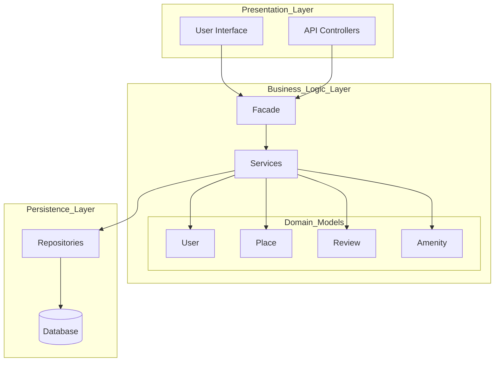

```mermaid
flowchart TD

%% Presentation Layer
subgraph Presentation_Layer
    UI[User Interface]
    API[API Controllers]
end

%% Business Logic Layer
subgraph Business_Logic_Layer
    Facade[Facade]
    Services[Services]
    
    subgraph Domain_Models
        User
        Place
        Review
        Amenity
    end
end

%% Persistence Layer
subgraph Persistence_Layer
    Repositories[Repositories]
    Database[(Database)]
end

%% Connections
UI --> Facade
API --> Facade

Facade --> Services
Services --> User
Services --> Place
Services --> Review
Services --> Amenity

Services --> Repositories
Repositories --> Database
```
