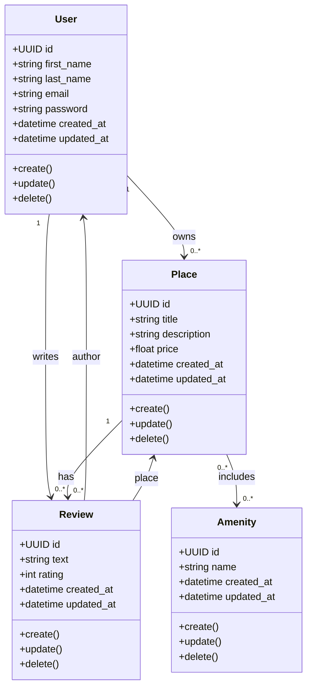

```mermaid
classDiagram

class User {
    +UUID id
    +string first_name
    +string last_name
    +string email
    +string password
    +datetime created_at
    +datetime updated_at
    +create()
    +update()
    +delete()
}

class Place {
    +UUID id
    +string title
    +string description
    +float price
    +datetime created_at
    +datetime updated_at
    +create()
    +update()
    +delete()
}

class Review {
    +UUID id
    +string text
    +int rating
    +datetime created_at
    +datetime updated_at
    +create()
    +update()
    +delete()
}

class Amenity {
    +UUID id
    +string name
    +datetime created_at
    +datetime updated_at
    +create()
    +update()
    +delete()
}

%% Relationships

User "1" --> "0..*" Place : owns
User "1" --> "0..*" Review : writes
Place "1" --> "0..*" Review : has
Place "0..*" --> "0..*" Amenity : includes
Review --> User : author
Review --> Place : place
```
