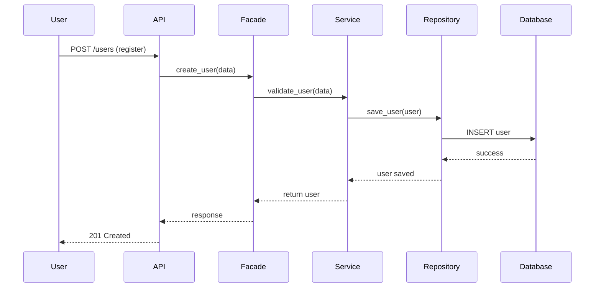
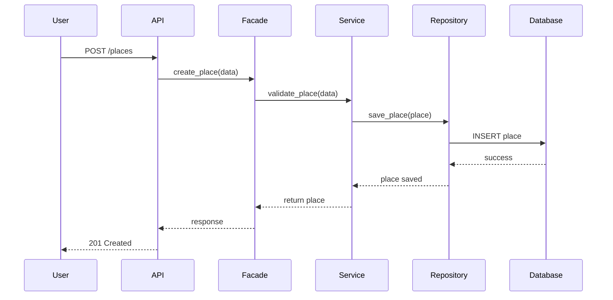
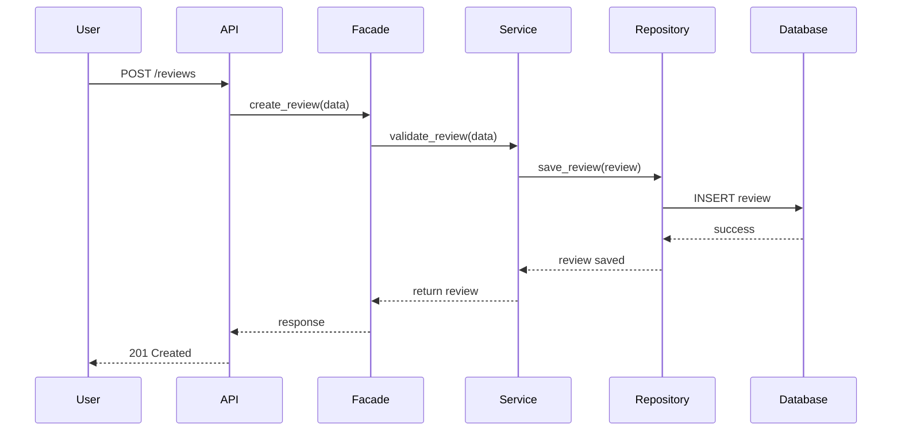
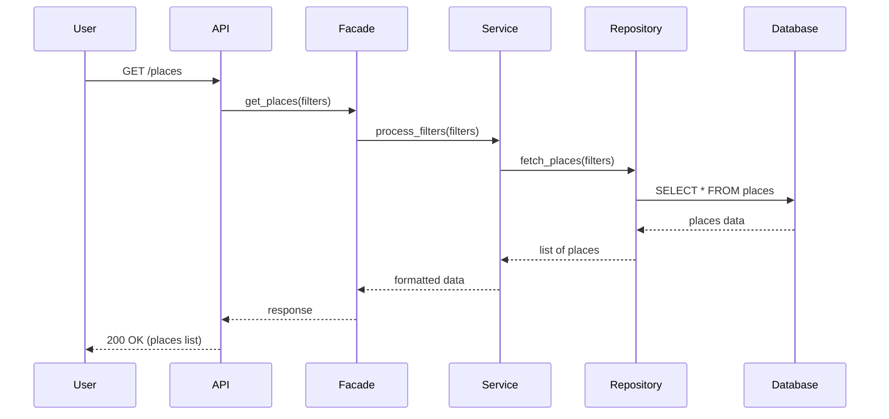

# Sequence Diagrams for API Calls

## 1. User Registration

---

## 2. Place Creation

---

## 3. Review Submission

---

## 4. Fetch List of Places

---

## Summary

All API calls follow this architecture:

User → API → Facade → Service → Repository → Database → Response

- **Presentation Layer:** API  
- **Business Logic Layer:** Facade + Service  
- **Persistence Layer:** Repository + Database  

The **Facade pattern** ensures a clean and simple interface between layers.
